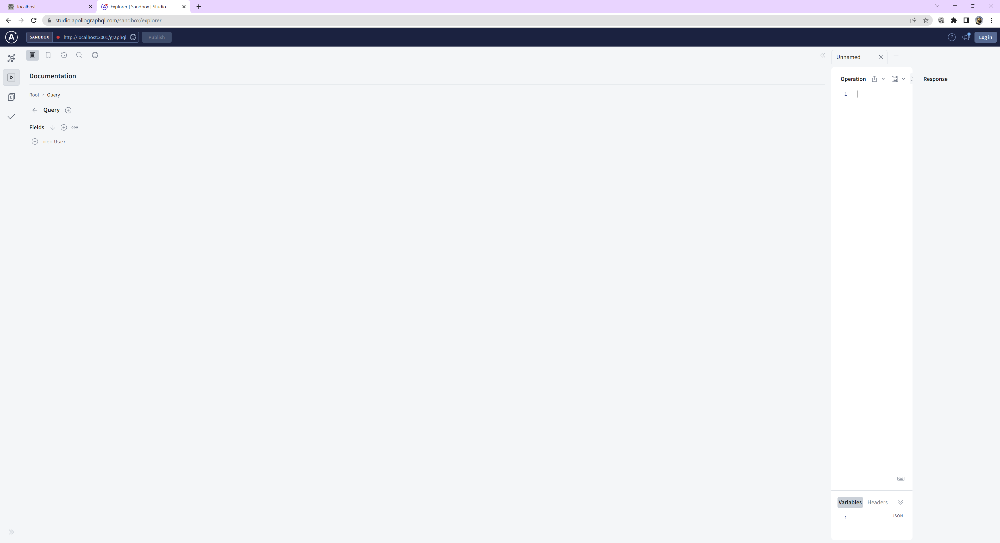

# Book Search
  ## Licensing:
  
  ## Table of Contents 
  - [Description](#description)
  - [Installation](#installation)
  - [Usage](#usage)
  - [Contribution](#contribution)
  - [Testing](#testing)
  - [Screenshots](#screenshots)
  - [Questions](#questions)
  - [Additional Info](#additional-info)
 
 
  ## Description:
  This is an app to search for books using google books api. The users can login and add books that they like to their saved books list or remove them later.
  ## Installation:
  To clone the repo run git clone https://git.heroku.com/nameless-thicket-56897.git in your terminal. After cloning the repo, run npm install to install the necessary dependencies.
  ## Usage:
  After necessary  installing all the dependencies, run npm start in your terminal to start the application.
  The app allows the user to view, add and delete books of your choice.
  ## License:
  MIT
  ## Contribution:
  No contributions at the moment. If anyone wishes to provide contributions, please contact the author.
  ## Testing:
  Testing not required.
  ## Screenshots:
    
    
    
   

  ## Questions
  [HERE](https://github.com/asrabilal)

   
  
  ## Additional Info:
  - Github: [asrabilal](https://github.com/asrabilal/BookSearch.git)
  - Email: asra596@gmail.com 

  

    
    
    
    
    
    
    

## URLs
Github repository link:https://github.com/asrabilal/BookSearch.git  
Deployed application link: https://git.heroku.com/nameless-thicket-56897.git/  
